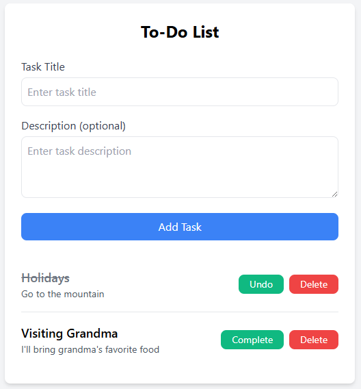

# To-Do List Application

A simple and intuitive web application built with **Laravel** for managing tasks. This project demonstrates CRUD operations, RESTful resource management, and dynamic views using Blade templates. It's a perfect portfolio piece for showcasing Laravel skills and modern web development practices.

## Table of Contents

-   [Features](#features)
-   [Technologies Used](#technologies-used)
-   [Installation](#installation)
-   [Usage](#usage)
-   [Contributing](#contributing)
-   [License](#license)
-   [Contact](#contact)

## Features

-   **Add Tasks:** Create new tasks with a title and optional description.
-   **View Tasks:** Display a list of all tasks with their statuses.
-   **Edit Tasks:** Update the details of existing tasks.
-   **Mark as Complete/Incomplete:** Toggle the completion status of tasks.
-   **Delete Tasks:** Remove tasks from the list.
-   **Responsive Design:** User-friendly interface optimized for various devices.
-   **Form Validation:** Ensure data integrity with server-side validation.

## Technologies Used

-   **Backend:** Laravel Framework (PHP)
-   **Frontend:** Blade Templates, Tailwind CSS
-   **Database:** MySQL (or SQLite for local development)
-   **Version Control:** Git
-   **Dependencies:** Composer, Node.js, NPM

## Installation

Follow these steps to set up the project locally:

### Prerequisites

-   **PHP** (>= 7.4)
-   **Composer**
-   **Node.js & NPM**
-   **MySQL** (or any other supported database)
-   **Git**

### Steps

1. **Clone the Repository**

    ```bash
    git clone https://github.com/indramusca/todo-list.git
    cd todo-list-app
    ```

2. **Install Composer Dependencies**

    ```bash
    composer install
    ```

3. **Install NPM Dependencies**

    ```bash
    npm install
    npm run dev
    ```

4. **Set Up Environment Variables**

    - Duplicate the `.env.example` file and rename it to `.env`.

        ```bash
        cp .env.example .env
        ```

    - Generate the application key:

        ```bash
        php artisan key:generate
        ```

    - Configure the `.env` file with your database credentials:

5. **Run Migrations**

    ```bash
    php artisan migrate
    ```

6. **Start the Development Server**

    ```bash
    php artisan serve
    ```

    The application will be accessible at `http://127.0.0.1:8000`.

## Usage

Once the development server is running, you can use the To-Do List application as follows:

1. **Add a New Task**

    - Enter the task title in the input field.
    - Optionally, add a description.
    - Click the "Add Task" button to save the task.

2. **View Tasks**

    - All tasks are listed below the form.
    - Completed tasks are marked with a strikethrough.

3. **Mark as Complete/Incomplete**

    - Click the "Complete" button to mark a task as completed.
    - Click the "Undo" button to revert the status.

4. **Edit a Task**

    - (Feature to be implemented) Future updates may include editing task details.

5. **Delete a Task**
    - Click the "Delete" button to remove a task from the list.

## Screenshots



## Contributing

Contributions are welcome! Follow these steps to contribute to the project:

1. **Fork the Repository**
2. **Create a New Branch**

    ```bash
    git checkout -b feature/YourFeatureName
    ```

3. **Make Changes and Commit**

    ```bash
    git commit -m "Add some feature"
    ```

4. **Push to the Branch**

    ```bash
    git push origin feature/YourFeatureName
    ```

5. **Open a Pull Request**

    Describe your changes and submit the pull request for review.

## License

This project is licensed under the [MIT License](LICENSE).

## Contact

If you have any questions or suggestions, feel free to reach out:

-   **Email:** imcahyamu@gmail.com
-   **LinkedIn:** [Your LinkedIn Profile](https://www.linkedin.com/in/imcahyamu)
-   **GitHub:** [your-username](https://github.com/indramusca)
